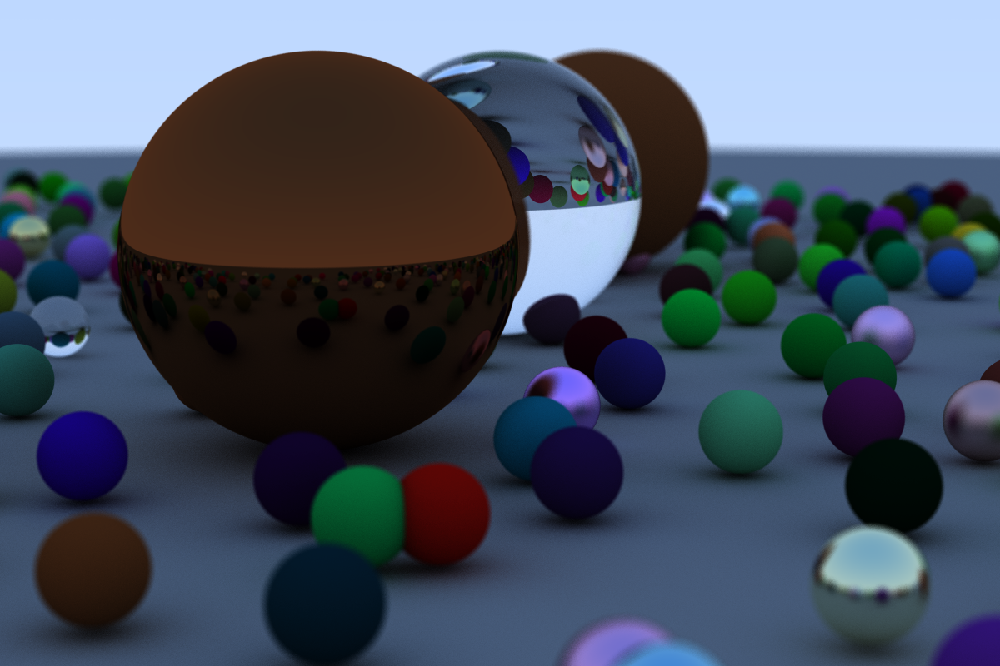

# Raytracer.rs

A rust implementation of [Ray Tracing in One Weekend](https://raytracing.github.io/books/RayTracingInOneWeekend.html#overview) built from scratch.

Final render of a complex scene with 500 samples per pixel and a maximum of 50 bounces per ray. 

